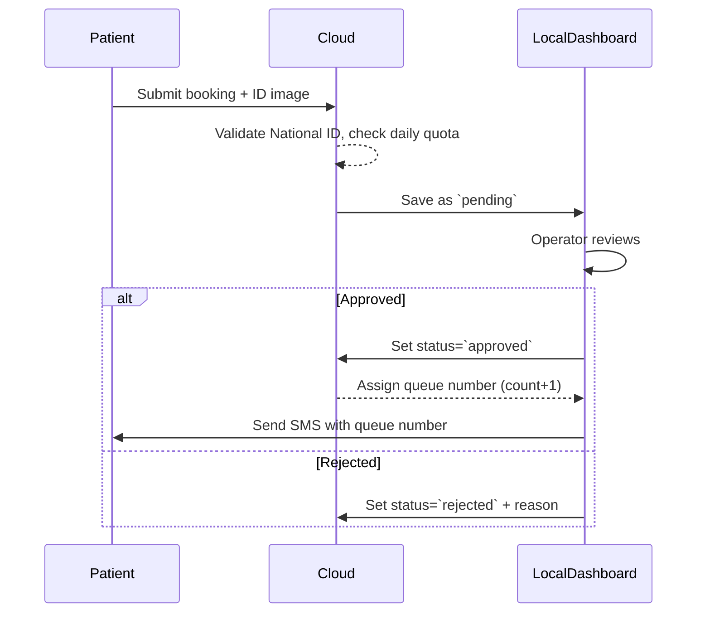

# NCI-Q

Smart Queue & Hybrid Appointment Management System for the National Cancer Institute, Menofia Branch pilot.

## Project Overview

NCI-Q is Phase 1 of a digital transformation initiative for outpatient clinic queue management. The project replaces a purely manual queue process with a hybrid model that combines online patient registration with local hospital staff verification.

Patients submit booking requests remotely through a public portal. Hospital data entry operators then review those requests from a local dashboard, approve valid submissions, reject invalid ones, and generate the active daily queue.

## Core Idea

The system is intentionally hybrid:

- Remote patients can submit appointment requests online.
- Each clinic has a daily online quota to prevent overbooking.
- Submitted requests start as `pending`.
- Hospital staff validate each request against the uploaded National ID card.
- Queue numbers are generated only after staff approval.
- Rejected requests are archived with a reason.

```text
[Patient at Home]
    |
    | Submit request with National ID data and ID card image
    v
[Cloud Portal / Backend]
    |
    | Validate National ID and check clinic quota
    v
[MongoDB: pending request]
    |
    | Reviewed from local hospital dashboard
    v
[Approve -> active queue number] or [Reject -> archived reason]
```

## Target Institution

- Institution: National Cancer Institute
- Pilot Branch: Menofia
- Phase: Phase 1

## Tech Stack

- Backend: Node.js, Express
- Database: MongoDB, Mongoose
- Frontend: React, Tailwind CSS
- Exporting: Excel export planned with `exceljs`

## Main Roles

### Patient

Patients use the public portal to submit:

- Full name
- Egyptian National ID number
- Phone number
- Target clinic or department
- Uploaded image of the National ID card

### Data Entry Operator

Hospital staff use the local dashboard to:

- Review pending requests
- Compare submitted text with the uploaded ID card
- Approve valid requests
- Reject invalid requests with a reason
- Monitor approved and rejected queues
- Export operational data for analysis

## Request Lifecycle

### 1. Online Registration

The patient submits a request from the public portal. Before saving the request, the backend validates the Egyptian National ID and checks the daily online quota for the selected clinic.

If validation passes and the quota is still available, the request is saved with:

```text
status = pending
```

No queue number is assigned at this stage.

### 2. National ID Validation

The backend validates the 14-digit Egyptian National ID by checking:

- It contains exactly 14 digits.
- The birth date section can be parsed.
- The governorate code is valid.
- The general structure is not obviously fake or malformed.

The parsed National ID can also provide useful analytical fields such as:

- Birth date
- Age group
- Gender
- Governorate

### 3. Daily Quota Check

Each clinic has a configurable daily online quota.

Example:

```text
Surgery clinic online quota = 30 requests per day
```

When the quota is reached, the public portal stops accepting new online requests for that clinic and instructs the patient to visit the hospital for a walk-in slot.

### 4. Local Verification

Hospital operators open the local dashboard and review requests in three main queues:

- Pending Queue: remote requests waiting for review
- Approved Queue: active patients cleared for today's clinic schedule
- Rejected Queue: archived denied requests with rejection reasons

### 5. Approval

When a request is approved, the backend:

- Changes the status to `approved`
- Stores approval information
- Generates the active queue number for that clinic and date

Queue number formula:

```text
new queue number = current approved count for clinic today + 1
```

### 6. Rejection

When a request is rejected, the backend:

- Changes the status to `rejected`
- Stores the rejection reason
- Keeps the request available for archive and reporting

Common rejection reasons:

- National ID image is unreadable
- Submitted data does not match the uploaded ID card
- Duplicate request
- Invalid or suspicious National ID
- Wrong clinic selection

## Dashboard Views

### Pending Queue

Displays incoming remote requests and uploaded ID card images for staff verification.

### Approved Queue

Displays active patients approved for the selected clinic and date, including queue numbers.

### Rejected Queue

Displays rejected requests, rejection reasons, and timestamps for auditing.

## Analytics and Excel Export

The dashboard will include an asynchronous Excel export feature for administration and operational analysis.

Planned filters:

- Date range
- Request status
- Clinic or department
- Governorate

Planned spreadsheet output:

- Patient demographics
- Clinic demand
- Geographic distribution
- Approval and rejection ratios
- Booking trends by day and time

Administrative benefits:

- Identify peak clinic days
- Improve doctor rotation planning
- Track high-demand departments
- Understand regional patient loads
- Measure accessibility issues through rejection patterns

## Suggested Project Structure

```text
NCI-Q/
  app.js
  models/
    Clinic.js
    PatientRequest.js
  README.md
```

## Phase 1 Scope

Included:

- Patient request submission
- National ID validation support
- Clinic quota tracking
- Pending, approved, and rejected request lifecycle
- Local dashboard data model
- Queue number generation after approval
- Excel-ready analytical fields

Not included yet:

- Full SMS gateway integration
- Advanced authentication and authorization
- Multi-branch deployment
- Payment handling
- Full hospital information system integration

## Status Values

| Status | Meaning |
| --- | --- |
| `pending` | Request submitted online and waiting for staff review |
| `approved` | Request verified by staff and assigned a queue number |
| `rejected` | Request denied and archived with a reason |

## Development Notes

The backend should treat queue assignment as a controlled staff action, not as part of public patient registration. This keeps the online portal from over-promising a final appointment position before human verification is complete.

The system should also enforce unique daily patient requests where possible to reduce duplicate bookings and protect clinic capacity.

// ---
/*
# NCI-Q — Smart Queue & Hybrid Appointment Management System (Phase 1)

**Target Institution:** National Cancer Institute (NCI) - Menofia Branch (Pilot)

## Executive Summary
The NCI-Q project implements a Hybrid Queue Model combining a Public Cloud Portal for remote patient booking with a Local Dashboard running on `localhost` for hospital Data Entry personnel. The goal is to balance online bookings (daily quotas per clinic) with local manual verification and active queue issuance.

## System Architecture (High-Level)
Two operational environments communicate securely:

- **Public Cloud Portal:** Remote patients submit booking requests (national ID, phone, clinic, ID image).
- **Local Dashboard (localhost):** Hospital operators review `pending` requests, `approve` or `reject` them, and issue active queue numbers.

Mermaid sequence diagram (local verification flow):



## Operational Workflow

### 1) Remote Patient Registration (Online)
- Inputs: Full name, 14-digit Egyptian National ID, phone, clinic, uploaded ID image.
- Server-side checks:
  - Parse and validate birthdate (digits 2–7).
  - Validate governorate code (digits 8–9) against official codes.
  - Enforce formatting rules to avoid dummy IDs.
  - Apply clinic daily quota: if full, reject new online bookings for the day.
- On success: store record in MongoDB with `status: "pending"`.

### 2) Data Entry Verification (Local)
Local Dashboard queues:
- `Pending` — incoming remote requests (with ID image preview).
- `Approved` — patients cleared and assigned queue numbers for today.
- `Rejected` — archived requests with rejection reasons.

Operator actions:
- Approve: verify text matches image → update to `approved` and compute queue number:
  $$\text{queueNumber} = \text{approvedCountForClinicToday} + 1$$
- Reject: update to `rejected` with a documented reason.

## API & Data Model (Outline)

### Sample API Endpoints
- `POST /api/bookings` — patient submission (stores `pending`).
- `GET /api/bookings?status=pending` — list pending for review.
- `POST /api/bookings/:id/approve` — operator approves and triggers queue assignment.
- `POST /api/bookings/:id/reject` — operator rejects with reason.
- `GET /api/export?from=YYYY-MM-DD&to=YYYY-MM-DD&status=approved` — async Excel export.

### Example Booking Document (MongoDB)
```json
{
  "_id": "...",
  "fullName": "...",
  "nationalId": "12345678901234",
  "phone": "+20...",
  "clinic": "Surgery",
  "idImageUrl": "...",
  "status": "pending|approved|rejected",
  "rejectionReason": null,
  "queueNumber": null,
  "createdAt": "...",
  "approvedAt": null
}
```

## National ID Validation (Algorithm sketch)
In Node.js the server should extract and verify parts of the 14-digit ID:

```javascript
function validateEgyptianId(id) {
  if (!/^\d{14}$/.test(id)) return false;
  const birth = id.slice(1,7); // YYMMDD or similar depending on spec
  // parse and validate date (adjust century from first digit if needed)
  const govCode = parseInt(id.slice(7,9), 10);
  const validGovs = new Set([1,2,3 /* populate with real codes */]);
  if (!validGovs.has(govCode)) return false;
  // additional checksum/format checks as required
  return true;
}
```

## Export to Excel (Example)
Use `exceljs` for asynchronous exports. Sketch:

```javascript
const ExcelJS = require('exceljs');
async function exportBookings(rows) {
  const wb = new ExcelJS.Workbook();
  const ws = wb.addWorksheet('Bookings');
  ws.columns = [
    {header:'Name', key:'fullName'},
    {header:'National ID', key:'nationalId'},
    {header:'Phone', key:'phone'},
    {header:'Clinic', key:'clinic'},
    {header:'Status', key:'status'},
    {header:'Queue #', key:'queueNumber'}
  ];
  rows.forEach(r => ws.addRow(r));
  await wb.xlsx.writeFile('./exports/bookings.xlsx');
}
```

## BI & Administrative Benefits
- Measure approved vs rejected ratios.
- Identify peak days/hours for staffing.
- Geographic load by governorate (extracted from National ID).

## Next Steps & Recommendations
- Populate the governorate code table and implement full ID checksum rules.
- Implement rate-limiting and strong file-upload scanning for ID images.
- Add end-to-end tests for quota enforcement and queue-number assignment.
- Optionally scaffold minimal backend/frontend prototypes in this repo.

---


