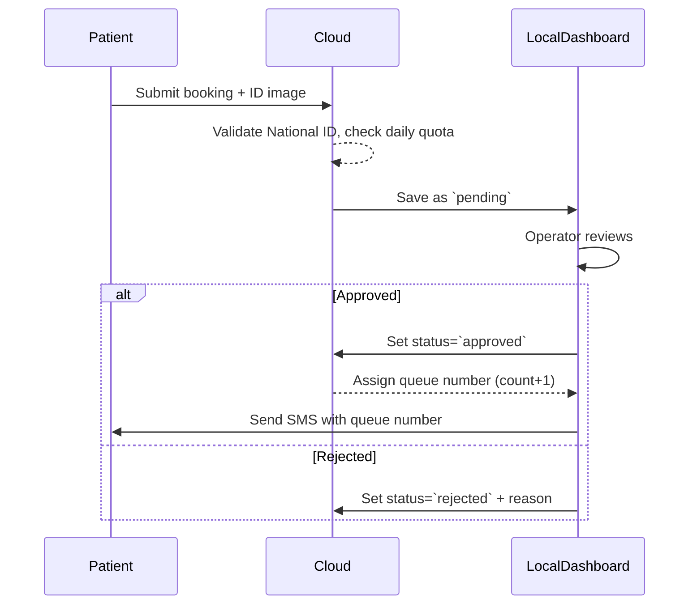

# NCI-Q — Smart Queue & Hybrid Appointment Management System (Phase 1)

**Target Institution:** National Cancer Institute (NCI) - Menofia Branch (Pilot)

## Executive Summary
The NCI-Q project implements a Hybrid Queue Model combining a Public Cloud Portal for remote patient booking with a Local Dashboard running on `localhost` for hospital Data Entry personnel. The goal is to balance online bookings (daily quotas per clinic) with local manual verification and active queue issuance.

## System Architecture (High-Level)
Two operational environments communicate securely:

- **Public Cloud Portal:** Remote patients submit booking requests (national ID, phone, clinic, ID image).
- **Local Dashboard (localhost):** Hospital operators review `pending` requests, `approve` or `reject` them, and issue active queue numbers.

Mermaid sequence diagram (local verification flow):



## Operational Workflow

### 1) Remote Patient Registration (Online)
- Inputs: Full name, 14-digit Egyptian National ID, phone, clinic, uploaded ID image.
- Server-side checks:
  - Parse and validate birthdate (digits 2–7).
  - Validate governorate code (digits 8–9) against official codes.
  - Enforce formatting rules to avoid dummy IDs.
  - Apply clinic daily quota: if full, reject new online bookings for the day.
- On success: store record in MongoDB with `status: "pending"`.

### 2) Data Entry Verification (Local)
Local Dashboard queues:
- `Pending` — incoming remote requests (with ID image preview).
- `Approved` — patients cleared and assigned queue numbers for today.
- `Rejected` — archived requests with rejection reasons.

Operator actions:
- Approve: verify text matches image → update to `approved` and compute queue number:
  $$\text{queueNumber} = \text{approvedCountForClinicToday} + 1$$
- Reject: update to `rejected` with a documented reason.

## API & Data Model (Outline)

### Sample API Endpoints
- `POST /api/bookings` — patient submission (stores `pending`).
- `GET /api/bookings?status=pending` — list pending for review.
- `POST /api/bookings/:id/approve` — operator approves and triggers queue assignment.
- `POST /api/bookings/:id/reject` — operator rejects with reason.
- `GET /api/export?from=YYYY-MM-DD&to=YYYY-MM-DD&status=approved` — async Excel export.

### Example Booking Document (MongoDB)
```json
{
  "_id": "...",
  "fullName": "...",
  "nationalId": "12345678901234",
  "phone": "+20...",
  "clinic": "Surgery",
  "idImageUrl": "...",
  "status": "pending|approved|rejected",
  "rejectionReason": null,
  "queueNumber": null,
  "createdAt": "...",
  "approvedAt": null
}
```

## National ID Validation (Algorithm sketch)
In Node.js the server should extract and verify parts of the 14-digit ID:

```javascript
function validateEgyptianId(id) {
  if (!/^\d{14}$/.test(id)) return false;
  const birth = id.slice(1,7); // YYMMDD or similar depending on spec
  // parse and validate date (adjust century from first digit if needed)
  const govCode = parseInt(id.slice(7,9), 10);
  const validGovs = new Set([1,2,3 /* populate with real codes */]);
  if (!validGovs.has(govCode)) return false;
  // additional checksum/format checks as required
  return true;
}
```

## Export to Excel (Example)
Use `exceljs` for asynchronous exports. Sketch:

```javascript
const ExcelJS = require('exceljs');
async function exportBookings(rows) {
  const wb = new ExcelJS.Workbook();
  const ws = wb.addWorksheet('Bookings');
  ws.columns = [
    {header:'Name', key:'fullName'},
    {header:'National ID', key:'nationalId'},
    {header:'Phone', key:'phone'},
    {header:'Clinic', key:'clinic'},
    {header:'Status', key:'status'},
    {header:'Queue #', key:'queueNumber'}
  ];
  rows.forEach(r => ws.addRow(r));
  await wb.xlsx.writeFile('./exports/bookings.xlsx');
}
```

## BI & Administrative Benefits
- Measure approved vs rejected ratios.
- Identify peak days/hours for staffing.
- Geographic load by governorate (extracted from National ID).

## Next Steps & Recommendations
- Populate the governorate code table and implement full ID checksum rules.
- Implement rate-limiting and strong file-upload scanning for ID images.
- Add end-to-end tests for quota enforcement and queue-number assignment.
- Optionally scaffold minimal backend/frontend prototypes in this repo.

---
*This README is an expanded Phase 1 specification and includes implementation sketches for developers.*
